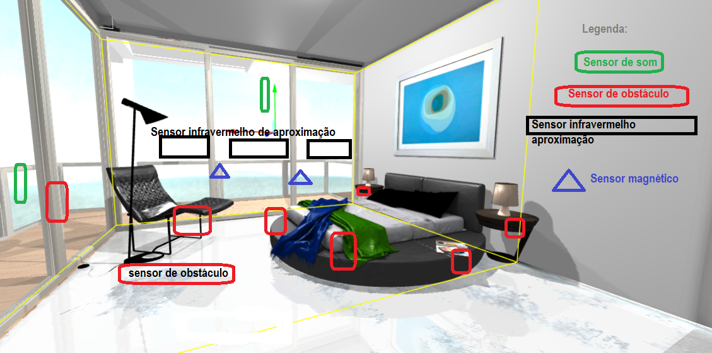

# ExercícioIOT Semana3
Para atividade da aula de Programação da IOT
Proposta de sistema de obstáculos para pessoas com pouca visibilidade ou deficientes visuais.
Esta proposta busca sensores e atuadores para auxiliar uma pessoa que irá passar um final de semana em uma pousada ou hotel, pois normalmente na sua residência ele conhece onde estão os objetos.  Os seguintes sensores serão utilizados:

Exemplo 1(um):
Sensor de movimento;
Sensor de Obstáculo KY-032;
Sensor de Som KY-037;
Sensor infravermelho;

Exemplo 2(dois):
Sensor infravermelho;
Sensor de Som KY-037;
Sensor de efeito hall magnético;

# Funcionamento do exemplo 1(um) é: 
quando a pessoa com pouca visibilidade ou deficiente visual se aproximar (sensor de movimento) de um objeto será acionado o (sensor de obstáculo), o sensor com o sinal infravermelho é refletido para o receptor que está localizado em algumas partes do corpo.  Quando isso acontece, o pino de saída OUT é colocado em nível baixo (0), e será acionado o (sensor de som), indicando que algum obstáculo foi detectado.

# Funcionamento do exemplo 2(dois) é:
Também será usado na porta do banheiro do quarto e na porta que dá acesso a varanda da hospedagem um sensor magnético, o motivo é que o sensor magnético é um equipamento cuja função é detectar o movimento de um campo magnético, gerado por um ímã, que, por sua vez, pode ser um acionador magnético, sendo ideal para realizar o monitoramento de portas de acesso a áreas de risco, para garantir a segurança a ele sair do quarto para varanda externa.
 Após ele entrar na varanda externa será acionado um sensor de aproximação(sensor infravermelho) para sua segurança, pois medirá aproximação da pessoa até o limite da varanda, então quando ele se aproximar muito do limite será acionado um som mais alto(sensor de som).

